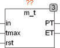

<!--
  Copyright (c) 2026 Hans Mühlbauer, Franz Höpfinger and others.

  This program and the accompanying materials are made available under the
  terms of the Eclipse Public License 2.0 which is available at
  https://www.eclipse.org/legal/epl-2.0

  SPDX-License-Identifier: EPL-2.0
-->

## Type	Funktionsbaustein

| | |
|:---|:---|
| **Input	IN** | BOOL (Eingangssignal) |
| **TMAX** | TIME (Timeout für ET) |
| **RST** | BOOL (Reset Eingang) |
| **Output	PT** | TIME (gemessene Impulsdauer von der steigenden bis zur  	fallenden Flanke) |
| **ET** | TIME (Abgelaufene Zeit seit letzter Steigender Flanke) |
| | M_T misst die Zeit wie lange IN TRUE war. PT ist die Zeit von der steigenden Flanke des  IN Signals bis zur fallenden Flanke des IN Signals. Der Ausgang ET ist die abgelaufene Zeit seit der letzten steigenden Flanke bis zur fallenden Flanke. Solange das Eingangssignal FALSE ist, ist ET = 0. M_T benötigt eine steigende Flanke um die Messung zu triggern. Falls beim ersten Aufruf in bereits TRUE ist, wird dies nicht als steigende Flanke gewertet. Weitere Beispiele sind in der Beschreibung von M_TX zu finden. Mit TRUE am Eingang RST können die Ausgänge jederzeit auf 0 zurückgesetzt werden. Erreicht ET den Wert TMAX wird automatisch im Baustein ein Reset erzeugt und alle Ausgänge auf 0 zurückgesetzt. TMAX ist intern mit einem Vorgabewert von T#10d belegt und kann im Normalfall unbeschaltet bleiben. |

