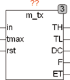

<!--
  Copyright (c) 2026 Hans Mühlbauer, Franz Höpfinger and others.

  This program and the accompanying materials are made available under the
  terms of the Eclipse Public License 2.0 which is available at
  https://www.eclipse.org/legal/epl-2.0

  SPDX-License-Identifier: EPL-2.0
-->

## M_TX

| | |
|:---|:---|
| **Type** | Funktionsbaustein |
| **Input	IN** | BOOL (Eingangssignal) |
| **TMAX** | TIME (Timeout für ET) |
| **RST** | BOOL (Reset Eingang) |
| **Output	TH** | TIME (Ontime des Eingangssignals) |
| **TL** | TIME (Offtime des Eingangssignals) |
| **DC** | REAL (Tastverhältnis / DutyCycle des Eingangssignals) |
| **F** | REAL (Frequenz des Eingangssignals in Hz) |
| **ET** | TIME (Vergangene Zeit während der Messung) |
| | M_TX ermittelt aus dem Eingangssignal IN die Zeit, welche das Signal IN auf TRUE war (TH) und die Zeit die das Signal auf FALSE war (TL). Die Zeiten TH und TL werden nur nach einer steigenden beziehungsweise fallenden Flanke gemessenen. Ist IN beim ersten Aufruf des Bausteins bereits high wird dies nicht als steigende Flanke gewertet. Aus den  gemessenen Werten TH und TL werden der DutyCycle und die Frequenz in Hz errechnet. Ein DutyCycle von 0,4 bedeutet das Signal war 40%  TRUE und 60% FALSE. Der Ausgang ET vom Typ TIME wird mit jeder steigenden Flanke bei 0 gestartet und läuft aufwärts, bis die nächste steigende Flanke ihn wieder bei 0 startet. Mit einem TRUE am Eingang RST können die Ausgänge zu jederzeit auf 0 zurückgesetzt werden. Der Eingang TMAX legt fest, nach welcher abgelaufenen Zeit an ET automatisch die Ausgänge zurückgesetzt werden.  TMAX ist intern mit einem Vorgabewert von T#10d belegt und kann im Normalfall offen bleiben. Der Eingang TMAX dient vor allem dazu, bei fehlendem Eingangssignal nach einer definierten Zeit die Ausgänge zurückzusetzen. Ein Beispiel für eine mögliche Anwendung ist die Messung der Drehzahl einer Welle, die nach Ausbleiben der Sensorsignale die Drehzahl (Frequenz) 0 anzeigt. TMAX ist aber mit Vorsicht anzuwenden, da zum Beispiel ein TMAX von 10 Sekunden gleichzeitig die kleinste Messbare Frequenz auf 0,1 HZ begrenzt. |

