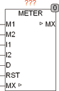
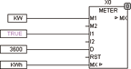
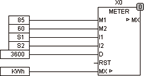

<!--
  Copyright (c) 2026 Hans Mühlbauer, Franz Höpfinger and others.

  This program and the accompanying materials are made available under the
  terms of the Eclipse Public License 2.0 which is available at
  https://www.eclipse.org/legal/epl-2.0

  SPDX-License-Identifier: EPL-2.0
-->

## Type	Funktionsbaustein

| | |
|:---|:---|
| **Input	M1** | REAL (Verbrauchswert 1) |
| **M2** | REAL (Verbrauchswert 2) |
| **I1** | BOOL (Freigabeeingang 1) |
| **I2** | BOOL (Freigabeeingang 2) |
| **D** | REAL (Teiler für den Ausgang) |
| **RST** | BOOL (Reset Eingang) |
| **I/O	MX** | REAL (Verbrauchswert) |
| | METER ist ein Verbrauchszähler, der 2 unabhängige Eingänge (M1 und M2) über die Zeit aufaddiert. Die Verbrauchszählung wird durch die Eingänge I1 und I2 gesteuert. Mit einem Reset-Eingang RST kann der Zähler jederzeit zurückgesetzt werden. Der Wert M1 wird je Sekunde zum Ausgangswert addiert solange I1 auf TRUE steht und analog wird der Wert M2 je Sekunde zum Ausgang addiert wenn I2 TRUE ist. Sind I1 und I2 TRUE, so wird der Wert M1 + M2 je Sekunde einmal zum Ausgang hinzu addiert. Der Eingang D Teilt den Ausgang MX. Damit können z B. Wattstunden anstatt Wattsekunden gezählt werden. Der Baustein benutzt intern den OSCAT spezifischen Datentyp [REAL2](../../Data Types/real2.md) der eine Auflösung von 15 Dezimalstellen erlaubt. Dadurch ist es dem Baustein möglich kleinste Verbrauchswerte an den Eingängen M1 und M2 mit kurzen Zykluszeiten zu erfassen und zu hohen Gesamtwerten am Ausgang MX addieren. Die Auflösung des Bausteins kann wie folgt ermittelt werden. MX ist als I/O definiert und muss auf eine externe Variable vom Typ REAL gelegt werden. Die externe Variable kann auf Wunsch als Remanent und / oder Persistent deklariert werden um den Wert bei Spannungsausfall zu erhalten. |
| | MX / 10^15 entspricht der minimalen Auflösung an den Eingängen M1 und M2. |

**Beispiel:**

Beispiel: MX = 10E6	der Verbrauchszähler steht bei 10 MWh M1 = 0.09 Watt	Momentanverbrauch liegt bei 0.1 Watt D = 3600		Ausgang arbeitet in Wh (Wattstunden) Zykluszeit beträgt 10ms In diesem Beispiel wird je Zyklus ein Wert von 0.09[W] * 0.01 [S] / 3600 = 2.5E-7[Wh] zum Ausgang MX addiert. Dies entspricht einer Veränderung an der 14 Dezimalstelle des Ausgangs. Beispiel 1 Stromverbrauchszähler: Der Stromverbrauchszähler zählt die Kilowattsekunden am Eingang M1. Durch den Eingang D wird der Ausgang durch 3600 geteilt, sodass der Ausgang Kilowattstunden anzeigt. Beispiel 2  Verbrauchsberechnung für einen 2 Stufen Brenner: In diesem Beispiel ist die Leistung von Stufe 1 (M1) 85KW und Stufe 2 (M2) 60KW. Die Eingänge S1 und S1 (I1 und I2) werden TRUE, wenn die entsprechende Stufe läuft. Durch die Konstante 3600 an D wird der Ausgang durch 3600 geteilt, sodass Kilowattstunden angezeigt werden.
