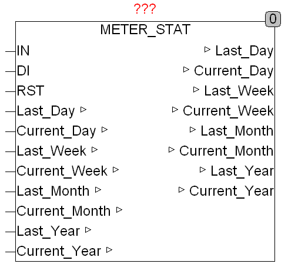

<!--
  Copyright (c) 2026 Hans Mühlbauer, Franz Höpfinger and others.

  This program and the accompanying materials are made available under the
  terms of the Eclipse Public License 2.0 which is available at
  https://www.eclipse.org/legal/epl-2.0

  SPDX-License-Identifier: EPL-2.0
-->

## Type	Funktionsbaustein

| | |
|:---|:---|
| **Input	IN** | REAL (Eingangssignal) |
| **DI** | DATE (Datumseingang) |
| **RST** | BOOL (Reset Eingang) |
| **I/O	LAST_DAY** | REAL (Verbrauchswert des vergangenen Tages) |
| **CURRENT_DAY** | REAL (Verbrauchswert des aktuellen Tages) |
| **LAST_WEEK** | REAL (Verbrauchswert der vergangenen Woche) |
| **CURRENT_WEEK** | REAL (Verbrauchswert der aktuellen Woche) |
| **LAST_MONTH** | REAL (Verbrauchswert des letzten Monats) |
| **CURRENT_MONTH** | REAL (Verbrauch des aktuellen Monats) |
| **LAST_YEAR** | REAL (Verbrauchswert des vergangenen Jahres) |
| **CURRENT_YEAR** | REAL (Verbrauchswert des aktuellen Jahres) |
| | METER_STAT errechnet den Verbrauch des aktuellen Tages, Woche, Monat und Jahr und zeigt den Wert des letzten Vergleichszeitraumes. Der aufaddierte Verbrauchswert liegt am Eingang IN, während am Eingang DI das aktuelle Datum anliegt. Mit dem Eingang RST kann der Zähler jederzeit zurückgesetzt werden. Zur einfacheren Speicherung im Persistent- und Remanent-speicher sind die Ausgänge als I/O definiert. |
| **Das folgende Beispiel zeigt die Anwendung von METER_STAT mit dem Baustein METER** |  |

