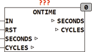
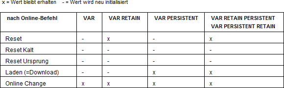
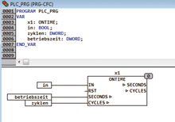

<!--
  Copyright (c) 2026 Hans Mühlbauer, Franz Höpfinger and others.

  This program and the accompanying materials are made available under the
  terms of the Eclipse Public License 2.0 which is available at
  https://www.eclipse.org/legal/epl-2.0

  SPDX-License-Identifier: EPL-2.0
-->

## Type	Funktionsbaustein

| | |
|:---|:---|
| **Input	IN** | BOOL (Eingangssignal) |
| **RST** | BOOL (Reset Eingang) |
| **Output	SECONDS** | UDINT (Betriebszeit in Sekunden) |
| **CYCLES** | UDINT (Einschaltzyklen des Eingangs IN) |
| | ONTIME ist ein Betriebsstundenzähler. Es wird die gesamte Zeit aufsummiert, die das Signal IN seit dem letzten Reset auf TRUE war. Zusätzlich wird die Anzahl der gesamten Ein / Aus Zyklen ermittelt. Die Ausgabewerte sind vom Typ UDINT. Mit dem Eingang RST können die Ausgangswerte jederzeit zurückgesetzt werden. Die Ausgangswerte sind nicht in Variablen des Bausteins gespeichert, sondern werden extern angelegt und über IO (POINTER) angebunden. Dies hat den entscheidenden Vorteil das je nach Wunsch des Anwenders die Variablen als RETAIN und / oder PERSISTENT festgelegt werden können. Es ist damit auch möglich alte Betriebsstunden abzuspeichern und später wieder herzustellen, zum Beispiel bei CPU Wechsel. |
| | Die Deklaration der Variablen an den Eingängen SECONDS und CYCLES müssen vom Typ UDINT sein und können wahlweise als VAR, VAR RETAIN oder VAR RETAIN PERSISTENT angelegt werden. |
| | Die DEKLARATION Der Variablen für die Betriebszeit und die Zyklen muss vom Typ UDINT sein und kann alternativ RETAIN und oder PERSISTENT erfolgen. |
| | VAR RETAIN PERSISTENT |
| **Betriebszeit_in_Sekunden** | UDINT; |
| **Zyklen** | UDINT; |
| | END_VAR |
| **Die folgende Tabelle erläutert RETAIN und PERSISTENT** |  |
| | Variablen vom Typ Retain und Persistent behalten ihren Wert bei Download, Online Change und Reset. Bei einem Reset-Kalt oder Reset-Ursprung jedoch verlieren auch diese Variablen Ihre Werte. Der Anwender kann jedoch die Werte im File-System oder in Netzwerk abspeichern und sie selbst z.B. nach einem Wechsel der CPU wiederherstellen . |

