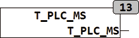

<!--
  Copyright (c) 2026 Hans Mühlbauer, Franz Höpfinger and others.

  This program and the accompanying materials are made available under the
  terms of the Eclipse Public License 2.0 which is available at
  https://www.eclipse.org/legal/epl-2.0

  SPDX-License-Identifier: EPL-2.0
-->

## Type	Funktion : DWORD

| | |
|:---|:---|
| **Output** | DWORD (SPS Timer in Millisekunden) |
| | T_PLC_MS liefert die aktuelle interne SPS Zeit in Millisekunden. Dies hat nichts mit einer eventuell vorhandenen Uhr (Real Time Baustein) zu tun, sondern ist der interne Timer einer SPS, der als Zeitreferenz benutzt wird. |
| **Der Quelltext des Bausteins hat folgende Eigenschaften** |  |
| **FUNCTION T_PLC_MS** | DWORD |
| | VAR CONSTANT |
| **DEBUG** | BOOL := FALSE; |
| **N** | INT := 0; |
| **OFFSET** | = 0; |
| | END_VAR |
| | VAR |
| **TEMP** | DWORD := 1; |
| | END_VAR |
| **T_PLC_MS** | = TIME_TO_DWORD(TIME()); |
| | IF DEBUG THEN |
| **T_PLC_MS** | = SHL(T_PLC_US,N) OR SHL(TEMP,N)-1 + OFFSET; |
| | END_IF; |
| | Im Normalbetrieb liest der Baustein mit der Funktion TIME() den internen Timer der SPS aus und liefert diesen zurück. Der Interne Timer der SPS nach IEC Norm hat 1 Millisekunde Auflösung. |
| | Eine weitere Eigenschaft von T_PLC_MS ist ein Debug-Modus, der es erlaubt den Überlauf des SPS internen Timers zu testen und die erstellte Software entsprechend sicher zu verifizieren. Der interne Timer jeder SPS hat unabhängig von Hersteller und Art der Implementierung nach einer festen Zeit einen Überlauf. Das heißt, er läuft gegen FF..FFFF (höchster Wert der im entsprechenden Typ gespeichert werden kann) und beginnt dann wieder bei 000..0000. bei Standard SPS Timern beträgt diese Überlaufzeit 2^32 -1 Millisekunden, was in etwa 49,71 Tagen entspricht. Da es sich bei diesem Timer um einen in Hardware implementierten Timer handelt kann auch sein Anfangswert nicht gesetzt werden, sodass er nach dem Einschalten der SPS immer bei 0 anfängt und bis zum Maximalwert hoch läuft. Nach erreichen des Maximalwertes entsteht dann der berüchtigte Timer-Überlauf, der fatale Auswirkungen in der Anwendungssoftware hervor ruft, aber nur extrem schwer getestet werden kann. |
| | T_PLC_MS bietet mehrere Möglichkeiten zum Testen des Überlaufs und zeitabhängiger Software. Mit der Konstante DEBUG kann der Test-Modus eingeschaltet werden und dann mittels der Konstanten N und Offset der Timer ab einem bestimmten Wert beginnen, damit gezielt der Überlauf getestet werden kann ohne die 49 Tage abzuwarten. Offset legt hierbei den Wert fest, der zum internen Timer addiert wird. Mit der Konstanten N wird festgelegt, um wie viele Bits der interne Timer Wert nach links verschoben wird und dabei die unteren N Bits mit 1 gefüllt werden. Mit N kann dadurch die Geschwindigkeit des internen Timers um die Faktoren 2,4,8,16 usw. erhöht werden. |
| | T_PLC_US bietet also alle Möglichkeiten zum Test zeitabhängiger Software, sowohl für die Problematik des Überlaufs, als auch für sehr langsame zeitabhängige Funktionen. |
| | Die Konstanten DEBUG, N und OFFSET wurden absichtlich nicht als Eingänge der Funktion implementiert um eine versehentliche Fehlbedienung zu vermeiden. |

