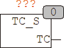

<!--
  Copyright (c) 2026 Hans Mühlbauer, Franz Höpfinger and others.

  This program and the accompanying materials are made available under the
  terms of the Eclipse Public License 2.0 which is available at
  https://www.eclipse.org/legal/epl-2.0

  SPDX-License-Identifier: EPL-2.0
-->

## Type	Funktionsbaustein

| | |
|:---|:---|
| **Output	TC** | REAL (letzte Zykluszeit in Sekunden) |
| | TC_S ermittelt die letzte Zykluszeit, das ist die Zeit die seit dem letzten Aufruf des Bausteins vergangen ist. Die Zeit wird in Sekunden geliefert, hat aber eine Genauigkeit in Mikrosekunden. Der Baustein ruft die Funktion T_PLC_US() auf. T_PLC_US() liefert den SPS internen Timer in Mikrosekunden mit einer Schrittweite von 1000 Mikrosekunden. Wird eine höhere Auflösung gewünscht muss die Funktion T_PLC_US() dem entsprechenden System angepasst werden. |

