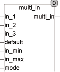

<!--
  Copyright (c) 2026 Hans Mühlbauer, Franz Höpfinger and others.

  This program and the accompanying materials are made available under the
  terms of the Eclipse Public License 2.0 which is available at
  https://www.eclipse.org/legal/epl-2.0

  SPDX-License-Identifier: EPL-2.0
-->

## MULTI_IN

| | |
|:---|:---|
| **Type	Funktion** | REAL |
| **Input	IN_1** | REAL (Eingang 1) |
| **IN_2** | REAL (Eingang 2) |
| **IN_3** | REAL (Eingang 3) |
| **DEFAULT** | REAL (Vorgabewert) |
| **IN_MIN** | REAL (unterer Grenzwert für Eingänge) |
| **IN_MAX** | REAL (oberer Grenzwert für Eingänge) |
| **MODE** | Byte (Auswahl des Betriebsmodus) |
| **Output** | REAL (Ausgangssignal) |
| | MULTI_IN ist ein Sensorinterface, das bis zu 3 Sensoren einliest, auf Fehler überprüft und abhängig vom Eingangsmodus einen Ausgangswert berechnet. |
| | Unabhängig vom eingestellten Mode werden Eingangswerte, die größer als IN_MAX oder kleiner als IN_MIN sind ignoriert. Ist keine Berechnung wie durch Mode vorgegeben mehr möglich, wird der Eingang Default als Ausgangswert benutzt. Multi_in wird eingesetzt, wenn verschiedene Sensoren den gleichen Wert messen und hohe Sicherheit und Zuverlässigkeit gefragt ist. Eine mögliche Anwendung ist die Messung der Außentemperatur an verschiedenen Stellen und die Überwachung auf Kabel oder Sensorbruch. |

| Mode | Funktion |
| --- | --- |
| 0 | MULTI_in = Durchschnitt der Eingänge in_1 .. 3 |
| 1 | MULTI_in = Eingang in_1 |
| 2 | MULTI_in = Eingang in_2 |
| 3 | MULTI_in = Eingang in_3 |
| 4 | MULTI_in = Default Eingang |
| 5 | MULTI_in = kleinster Wert der Eingänge in_1 .. 3 |
| 6 | MULTI_in = größter Wert der Eingänge in_1 .. 3 |
| 7 | MULTI_in = mittlerer Wert der Eingänge in_1..3 |
| >7 | MULTI_in = 0 |
