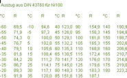

<!--
  Copyright (c) 2026 Hans Mühlbauer, Franz Höpfinger and others.

  This program and the accompanying materials are made available under the
  terms of the Eclipse Public License 2.0 which is available at
  https://www.eclipse.org/legal/epl-2.0

  SPDX-License-Identifier: EPL-2.0
-->

## RES_NI

| | |
|:---|:---|
| **Type	Funktion** | REAL |
| **Input	T** | REAL (Temperatur in °C) |
| **R0** | REAL (Widerstand bei 0 °C) |
| **Output** | REAL (Widerstandswert) |
| | RES_NI berechnet den Widerstand eines NI-Widerstandsfühlers aus den Eingangswerten T (Temperatur in °C) und R0 (Widerstand bei 0°C). |
| **Die Berechnung erfolgt nach der Formel** |  |
| | RES_NI = R0 + A*T + B*T²+C*T4 |
| | A = 0.5485 |
| | B = 0.665E-3 |
| | C = 2.805E-9 |
| | Die Berechnung ist geeignet für einen Temperaturen von -60 .. +180 °C. |

