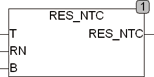

<!--
  Copyright (c) 2026 Hans Mühlbauer, Franz Höpfinger and others.

  This program and the accompanying materials are made available under the
  terms of the Eclipse Public License 2.0 which is available at
  https://www.eclipse.org/legal/epl-2.0

  SPDX-License-Identifier: EPL-2.0
-->

## RES_NTC

| | |
|:---|:---|
| **Type	Funktion** | REAL |
| **Input	T** | REAL (Temperatur in °C) |
| **RN** | REAL (Widerstand bei 25 °C) |
| **B** | REAL (Charakteristischer wert des Sensors) |
| **Output** | REAL (Widerstandswert) |
| | RES_NTC berechnet den Widerstand eines NTC-Widerstandsfühlers aus den Eingangswerten T (Temperatur in °C) und RN (Widerstand bei 25°C). Der Eingangswert B ist eine Konstante die aus den Sensor Datenblättern entnommen werden muss. Typische Werte für NTC Sensoren liegen bei 2000 – 4000 Kelvin. |
| **Die Berechnung erfolgt nach der Formel** |  |
| | Die Formel liefert eine hinreichende Genauigkeit für kleine Temperaturbereiche wie z.B. 0-100 °C. Für weite Temperaturbereiche ist die Formal nach Steinhart besser geeignet. |

