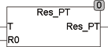

<!--
  Copyright (c) 2026 Hans Mühlbauer, Franz Höpfinger and others.

  This program and the accompanying materials are made available under the
  terms of the Eclipse Public License 2.0 which is available at
  https://www.eclipse.org/legal/epl-2.0

  SPDX-License-Identifier: EPL-2.0
-->

## Type	Funktion : REAL

| | |
|:---|:---|
| **Input	T** | REAL (Temperatur in °C) |
| **R0** | REAL (Widerstand bei 0 °C) |
| **Output** | REAL (Widerstandswert) |
| | RES_PT berechnet den Widerstand eines PT-Widerstandsfühlers aus den Eingangswerten T (Temperatur in °C) und R0 (Widerstand bei 0°C). |
| **Die Berechnung erfolgt nach der Formel** |  |
| | für Temperaturen > 0 °C |
| | RES_PT = R0 * (1 + A*T + B*T²) |
| | und für Temperaturen < 0°C |
| | RES_PT = R0 * (1 + A*T + B*T² + C*(T-100)*T³ |
| | A = 3.90802E-3 |
| | B = -5.80195E-7 |
| | C = -427350E-12 |
| | Die Berechnung ist geeignet für Temperaturen von -200 .. +850 °C. |

