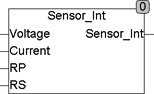

<!--
  Copyright (c) 2026 Hans Mühlbauer, Franz Höpfinger and others.

  This program and the accompanying materials are made available under the
  terms of the Eclipse Public License 2.0 which is available at
  https://www.eclipse.org/legal/epl-2.0

  SPDX-License-Identifier: EPL-2.0
-->

## Type	Funktion : REAL

| | |
|:---|:---|
| **Input	VOLTAGE** | REAL (gemessen Spannung in Volt) |
| **CURRENT** | REAL (gemessener Strom in Ampere) |
| **RP** | REAL (paralleler parasitärer Widerstand in Ohm) |
| **RS** | REAL (serieller parasitärer Widerstand in Ohm) |
| **Output** | REAL (Widerstandswert des Sensors) |
| | SENSOR_INT berechnet den Sensorwiderstand unter Berücksichtigung der Parasitären Widerstände, die die Messung normalerweise verfälschen. Der A/D Wandler misst entweder Strom bei fester Spannung oder Spannung bei festem Strom. Der daraus resultierende Widerstand ist aber nicht nur der Widerstand des Sensors, sondern setzt sich zusammen aus dem Widerstand des Sensors und 2 parasitären Widerständen RP und RS. Da die parasitären Widerstände konstant bleiben, können Sie wieder kompensiert werden und der wirkliche Widerstand des Sensors errechnet werden. |
| | RPRSRXABDer zwischen den Anschlüssen A und B gemessene Widerstand (gemessen durch Strom und Spannung ist ein Gesamtwiderstand aus dem Sensorwiderstand parallel mit dem parasitären Widerstand RP und dem Leitungswiderstand RS. RS und RP werden kompensiert und der wirkliche Widerstand RX berechnet. Mit den Modulen TEMP_ kann dann zum Beispiel die exakte Temperatur berechnet werden. |

