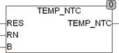
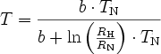

<!--
  Copyright (c) 2026 Hans Mühlbauer, Franz Höpfinger and others.

  This program and the accompanying materials are made available under the
  terms of the Eclipse Public License 2.0 which is available at
  https://www.eclipse.org/legal/epl-2.0

  SPDX-License-Identifier: EPL-2.0
-->

## Type	FUNKTION : REAL

| | |
|:---|:---|
| **Input	RES** | REAL (gemessener Widerstandswert in Ohm) |
| **RN** | REAL (Widerstandswert des Sensors bei 25 °C) |
| **B** | REAL (Spezifikation des Sensors) |
| **Output** | REAL (gemessene Temperatur) |
| | TEMP_NTC errechnet aus dem gemessenen Widerstand und den Parametern des Sensors die gemessene Temperatur. RN ist der Widerstandswert des Sensors bei 25 °C und B ist Abhängig vom Sensor und der Spezifikation des Sensors zu entnehmen. |
| **Der Baustein errechnet die Temperatur nach folgender Formel** |  |

