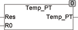
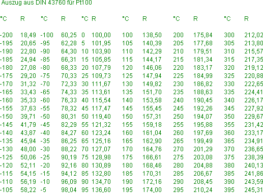

<!--
  Copyright (c) 2026 Hans Mühlbauer, Franz Höpfinger and others.

  This program and the accompanying materials are made available under the
  terms of the Eclipse Public License 2.0 which is available at
  https://www.eclipse.org/legal/epl-2.0

  SPDX-License-Identifier: EPL-2.0
-->

## Type	Funktion : REAL

| | |
|:---|:---|
| **Input	RES** | REAL (gemessener Widerstandswert in Ohm) |
| **R0** | REAL (Widerstand bei 0 °C) |
| **Output** | REAL (gemessene Temperatur) |
| | TEMP_PT berechnet die Temperatur eines PT-Widerstandsfühlers aus den Eingangswerten RES (gemessener Widerstandswert) und R0 (Widerstand bei 0°C). Wenn die Eingänge eine Temperatur außerhalb des Wertebereichs von -200 .. + 850°C ergeben wird am Ausgang die Temperatur +10000.0 °C ausgegeben. |
| **Die Berechnung erfolgt nach der Formel** |  |
| | für Temperaturen > 0 °C |
| | RES_PT = R0 * (1 + A*T + B*T²) |
| | und für Temperaturen < 0°C |
| | RES_PT = R0 * (1 + A*T + B*T² + C*(T-100)*T³ |
| | A = 3.90802E-3; B = -5.80195E-7; C = -427350E-12 |

