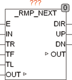
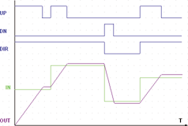

<!--
  Copyright (c) 2026 Hans Mühlbauer, Franz Höpfinger and others.

  This program and the accompanying materials are made available under the
  terms of the Eclipse Public License 2.0 which is available at
  https://www.eclipse.org/legal/epl-2.0

  SPDX-License-Identifier: EPL-2.0
-->

## _RMP_NEXT

| | |
|:---|:---|
| **Type** | Funktionsbaustein |
| **Input	E** | BOOL (Enable Eingang) |
| **IN** | BOOL (Eingang) |
| **TR** | TIME (Anstiegszeit für Rampe 0..255) |
| **TF** | TIME (Abfallzeit für Rampe 255..0) |
| **TL** | TIME (Sperrzeit zwischen einer Richtungsumkehr) |
| **I/O	OUT** | Byte (Ausgangssignal) |
| **OUTPUT	DIR** | BOOL (Richtung der Änderung an IN) |
| **UP** | BOOL (signalisiert eine steigende Rampe) |
| **DN** | BOOL (signalisiert eine fallende Rampe) |
| | RMP_NEXT folgt am Ausgang OUT dem Eingangssignal IN mit durch TR und TF definierten steigenden- oder fallenden- Flanken. Im Gegensatz zu RMP_SOFT läuft die Flanke von RMP_NEXT solange bis sie den Endpunkt über- oder unter-schritten hat und ist deshalb auch für Regelungsaufgaben geeignet. Verändert sich der Wert von IN so wird eine steigende Rampe mit TR oder eine fallende Flanke mit TF am Ausgang OUT gestartet bis der Wert an OUT den Eingangswert von IN über- beziehungsweise unter-schritten hat. Der Ausgang bleibt dann auf diesen Wert stehen. Die Ausgänge UP und DN zeigen an ob gerade eine steigende oder eine fallende Flanke erzeugt wird. Der Ausgang DIR gibt die Richtung der Veränderung an IN an, verändert sich IN nicht bleibt dieser Ausgang auf dem letzten Zustand. Die Sperrzeit TL legt fest wie lange die Totzeit zwischen einer Richtungsumkehr ist. |
| **Die folgende Graphik zeigt den Signalverlauf an OUT bei Änderung des Eingangsignals an IN** |  |

