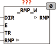

<!--
  Copyright (c) 2026 Hans Mühlbauer, Franz Höpfinger and others.

  This program and the accompanying materials are made available under the
  terms of the Eclipse Public License 2.0 which is available at
  https://www.eclipse.org/legal/epl-2.0

  SPDX-License-Identifier: EPL-2.0
-->

## Type	Funktionsbaustein

| | |
|:---|:---|
| **Input	DIR** | BOOL (Richtung, TRUE bedeutet Aufwärts) |
| **E** | BOOL (Enable Eingang) |
| **TR** | TIME (Zeit zum Durchlauf einer vollen Rampe) |
| **I/O	RMP** | WORD (Ausgangssignal) |
| | _RMP_B ist ein 16-Bit Rampen-Generator. Die Rampe wird in einer extern deklarierten Variable erzeugt. Die Rampe ist steigend wenn DIR = TRUE und fallend wenn DIR = FALSE. Erreicht die Rampe einen Endwert so bleibt der Generator auf diesem Wert stehen. Mit dem Eingang E kann die Rampe jederzeit angehalten werden, wenn E=TRUE läuft die Rampe. Der Eingang TR gibt an welche Zeit benötigt wird um die Rampe von 0 - 65535 oder umgekehrt zu durchlaufen. |

