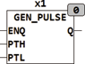

<!--
  Copyright (c) 2026 Hans Mühlbauer, Franz Höpfinger and others.

  This program and the accompanying materials are made available under the
  terms of the Eclipse Public License 2.0 which is available at
  https://www.eclipse.org/legal/epl-2.0

  SPDX-License-Identifier: EPL-2.0
-->

## Type	Funktionsbaustein

| | |
|:---|:---|
| **Input	ENQ** | BOOL (Enable Eingang) |
| **PTH** | TIME (Impulsdauer HIGH) |
| **PTL** | TIME (Impulsdauer LOW) |
| **Output	Q** | BOOL (Ausgangssignal) |
| **GEM_PULSE erzeugt am Ausgang Q ein Ausgangssignal das für die Zeit PTH auf TRUE ist und anschließend für PTL LOW bleibt. Der Generator startet nach ENQ = TRUE immer mit einer steigenden Flanke an Q und bleibt für die Zeit PTH TURE. Solange ENQ = TRUE werden kontinuierliche Impulse am Ausgang Q erzeugt. Ist eine der Zeiten (PTH, PTL) oder beide gleich 0 so wird die Zeit auf einen SPS Zyklus begrenzt. GEN_PULSE(ENQ** | = TRUE, PTH := T#0s, PTL := T#0s) erzeugt ein Ausgangssignal das einen Zyklus TRUE ist und einen Zyklus FALSE . Der Default Wert für ENQ ist TRUE. |

