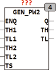

<!--
  Copyright (c) 2026 Hans Mühlbauer, Franz Höpfinger and others.

  This program and the accompanying materials are made available under the
  terms of the Eclipse Public License 2.0 which is available at
  https://www.eclipse.org/legal/epl-2.0

  SPDX-License-Identifier: EPL-2.0
-->

## Type	Funktionsbaustein

| | |
|:---|:---|
| **Input	ENQ** | BOOL (Enable Eingang) |
| **TH1** | TIME (Vorgabezeit HIGH wenn TS = LOW) |
| **TL1** | TIME (Vorgabezeit LOW wenn TS = LOW) |
| **TH2** | TIME (Vorgabezeit HIGH wenn TS = HIGH) |
| **TL2** | TIME (Vorgabezeit LOW wenn TS = HIGH) |
| **TS** | BOOL (Auswahl für Ablaufzeiten) |
| **Output	Q** | BOOL (Binäres Ausgangssignal) |
| **TL** | TIME (Ablaufzeit wenn Q = FALSE) |
| **TH** | TIME (Ablaufzeit wenn Q = TRUE) |
| | GEN_PW2 erzeugt ein Ausgangssignal mit einer definierbaren Zeit TH? für HIGH und TL für LOW. Mithilfe des Eingangs TS wird zwischen 2 Parametersätzen (TL1, TH1 und TL2, TH2) umgeschaltet. Beim Start oder nach einem ENQ = TRUE beginnt der Baustein mit der LOW Phase am Ausgang. |

