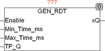

<!--
  Copyright (c) 2026 Hans Mühlbauer, Franz Höpfinger and others.

  This program and the accompanying materials are made available under the
  terms of the Eclipse Public License 2.0 which is available at
  https://www.eclipse.org/legal/epl-2.0

  SPDX-License-Identifier: EPL-2.0
-->

## Type	Funktionsbaustein

| | |
|:---|:---|
| **Input	ENABLE** | BOOL (Freigabeeingang) |
| **MIN_TIME_MS** | TIME (Minimale Periodendauer) |
| **MAX_TIME_MS** | TIME (Maximale Periodendauer) |
| **TP_Q** | TIME (Pulsbreite des Ausgangspulses an XQ) |
| **Output	XQ** | BOOL (Binäres Ausgangssignal) |
| | GEN_RDT erzeugt Impulse mit definierter Pulsbreite und Zufälligen Abstand. Die Ausgangsimpulse mit der Pulsbreite TP_Q werden in Zufälligen Zeitabständen TX erzeugt. TX schwankt zufällig zwischen der Zeit MIN_TIME_MS und MAX_TIME_MS. Der Baustein erzeugt nur Impulse an Ausgang XQ wenn der Eingang ENABLE auf TRUE ist. |

