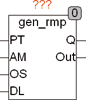
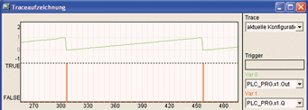

<!--
  Copyright (c) 2026 Hans Mühlbauer, Franz Höpfinger and others.

  This program and the accompanying materials are made available under the
  terms of the Eclipse Public License 2.0 which is available at
  https://www.eclipse.org/legal/epl-2.0

  SPDX-License-Identifier: EPL-2.0
-->

## Type	Funktionsbaustein

| | |
|:---|:---|
| **Input	PT** | TIME (Periodendauer) |
| **AM** | REAL (Signal Amplitude) |
| **OS** | REAL (Signal Offset) |
| **DL** | REAL (Signal Verzögerung 0..1 * PT) |
| **Output	Q** | BOOL (Binäres Ausgangssignal) |
| **OUT** | REAL (Analoges Ausgangssignal) |
| | GEN_RMP ist ein Sägezahngenerator. Er erzeugt am Ausgang OUT eine Rampe mit der Dauer PT und wiederholt diese fortlaufend. Der Ausgang Q wird für genau einen Zyklus TRUE, wenn die Rampe am Ausgang OUT beginnt. Der Eingang AM und OS legen die Amplitude und den Offset für den Ausgang OUT fest. Wenn die Eingänge OS und AM nicht beschaltet werden sind die Vorgabewerte 0 und 1. Der Ausgang OUT erzeugt dann ein Sägezahnsignal von 0 .. 1. Der Eingang DL kann das Ausgangssignal um bis zu eine Periode (PT) verschieben und dient dazu, mehrere zueinander verschobene Signale, zu erzeugen. Eine 0 am Eingang DL bedeutet keine Verschiebung. Ein Wert zwischen 0 und 1 verschiebt das Signal um bis zu einer Periode. |
| | Das folgende Beispiel zeigt eine Traceaufzeichnung für die Eingangswerte PT = 10s, AM = 1 und OS = 0. |

