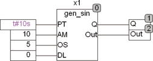

<!--
  Copyright (c) 2026 Hans Mühlbauer, Franz Höpfinger and others.

  This program and the accompanying materials are made available under the
  terms of the Eclipse Public License 2.0 which is available at
  https://www.eclipse.org/legal/epl-2.0

  SPDX-License-Identifier: EPL-2.0
-->

## Type	Funktionsbaustein

| | |
|:---|:---|
| **Input	PT** | TIME (Periodendauer) |
| **AM** | REAL (Signal Amplitude) |
| **OS** | REAL (Signal Offset) |
| **DL** | REAL (Signal Verzögerung 0..1 * PT) |
| **Output	Q** | BOOL (Binäres Ausgangssignal) |
| **OUT** | REAL (Analoges Ausgangssignal) |
| | GEN_SIN ist ein Sinusgenerator mit programmierbarer Periodendauer, einstellbarer Amplitude und Signal Offset. Als Besonderheit kann auch noch ein Delay eingestellt werden, damit mit mehreren Generatoren überlappende Signale erzeugt werden können. Ein Binärer Ausgang Q stellt ein Logisches Signal zur Verfügung das Phasengleich mit dem Sinussignal erzeugt wird. Der Eingang DL gibt ein Delay für das Ausgangssignal vor. Das Delay wird spezifiziert mit DL * PT. Ein DL von 0.5 verzögert das Signal um eine halbe Periode. |
| | Das folgende Beispiel zeigt GEN_SIN mit einer Traceaufzeichnung des Sinussignals und des binären Ausgangs Q. |
| | Obiges Beispiel Erzeugt ein Sinussignal mit 0.1 HZ (PT = 10 s) und einen unteren Spitzenwert von 0 und oberen Spitzenwert von 10. |

