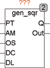

<!--
  Copyright (c) 2026 Hans Mühlbauer, Franz Höpfinger and others.

  This program and the accompanying materials are made available under the
  terms of the Eclipse Public License 2.0 which is available at
  https://www.eclipse.org/legal/epl-2.0

  SPDX-License-Identifier: EPL-2.0
-->

## Type	Funktionsbaustein

| | |
|:---|:---|
| **Input	PT** | TIME (Periodendauer) |
| **AM** | REAL (Signal Amplitude) |
| **OS** | REAL (Signal Offset) |
| **DC** | REAL (Tastverhältnis 0..1) |
| **DL** | REAL (Signal Verzögerung 0..1 * PT) |
| **Output	Q** | BOOL (Binäres Ausgangssignal) |
| **OUT** | REAL (Analoges Ausgangssignal) |
| | GEN_SQR ist ein Rechteckgenerator mit programmierbarer Periodendauer, einstellbarer Amplitude und Signal Offset sowie Tastverhältnis DC (DutyCycle). Als Besonderheit kann auch noch ein Delay eingestellt werden, damit mit mehreren Generatoren überlappende Signale erzeugt werden können. |
| | Das folgende Beispiel zeigt 2 GEN_SQR, wobei einer davon mit einem Delay von 0.25 ( ¼ Periode) läuft. In der Traceaufzeichnung ist deutlich das Signal des ersten Generators und das verzögerte Signal des zweiten Generators zu sehen. |

