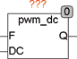
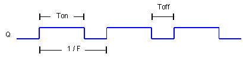

<!--
  Copyright (c) 2026 Hans Mühlbauer, Franz Höpfinger and others.

  This program and the accompanying materials are made available under the
  terms of the Eclipse Public License 2.0 which is available at
  https://www.eclipse.org/legal/epl-2.0

  SPDX-License-Identifier: EPL-2.0
-->

## PWM_DC

| | |
|:---|:---|
| **Type** | Funktionsbaustein |
| **Input	F** | REAL (Ausgangsfrequenz) |
| **DC** | REAL (Tastverhältnis 0..1) |
| **Output	Q** | BOOL (Ausgangssignal) |
| | PWM_DC ist ein Duty-Cycle modulierter Frequenzgenerator. Der Generator erzeugt eine feste Frequenz F mit einem Tastverhältnis (TON / TOFF), welche über den Eingang DC moduliert (Eingestellt) werden kann. Ein Wert von 0.5 am Eingang DC erzeugt ein Tastverhältnis von 50%. |
| | Das Folgende Signalbild zeigt ein Ausgangssignal mit einem Duty-Cycle von 2 / 1, was einem DC (Tastverhältnis) von 0.67 entspricht. |

