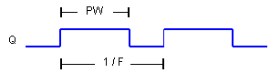

<!--
  Copyright (c) 2026 Hans Mühlbauer, Franz Höpfinger and others.

  This program and the accompanying materials are made available under the
  terms of the Eclipse Public License 2.0 which is available at
  https://www.eclipse.org/legal/epl-2.0

  SPDX-License-Identifier: EPL-2.0
-->

## Type	Funktionsbaustein

| | |
|:---|:---|
| **Input	F** | REAL (Ausgangsfrequenz) |
| **PW** | TIME (Impulsdauer High) |
| **Output	Q** | BOOL (Ausgangssignal) |
| | PWM_PW ist ein Puls breiten modulierter Frequenzgenerator. Der Generator erzeugt eine feste Frequenz F mit einem Tastverhältnis (TON / TOFF) das über den Eingang PW moduliert (eingestellt) werden kann. Der Eingang gibt die Zeit vor die das Signal auf TRUE bleibt. |

