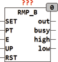
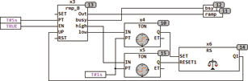
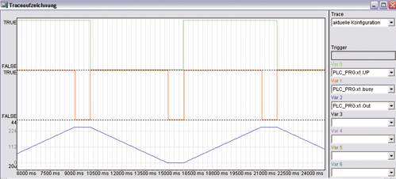
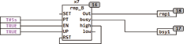
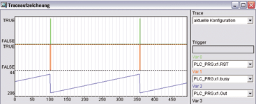

<!--
  Copyright (c) 2026 Hans Mühlbauer, Franz Höpfinger and others.

  This program and the accompanying materials are made available under the
  terms of the Eclipse Public License 2.0 which is available at
  https://www.eclipse.org/legal/epl-2.0

  SPDX-License-Identifier: EPL-2.0
-->

## Type	Funktionsbaustein

| | |
|:---|:---|
| **Input	SET** | BOOL (Set-Eingang) |
| **PT** | TIME (Dauer einer Rampe 0..255) |
| **E** | BOOL (Freigabeeingang) |
| **UP** | BOOL (Richtung UP=TRUE bedeutet Up) |
| **RST** | BOOL (Reset-Eingang) |
| **Output	OUT** | Byte (Ausgangssignal) |
| **BUSY** | BOOL (TRUE, wenn Rampe läuft) |
| **HIGH** | BOOL (Maximaler Ausgangswert ist erreicht) |
| **LOW** | BOOL (Minimaler Ausgangswert ist erreicht) |
| | RMP_B ist ein Rampengenerator mit 8 Bit (1 Byte) Auflösung. Die Rampe von 0..255 wird in maximal 255 Schritte unterteilt und in einer Zeit von PT einmal komplett durchlaufen. Ein Freigabesignal E schaltet den Rampengenerator an oder aus. Ein asynchroner Reset setzt jederzeit den Ausgang auf 0 und ein Impuls am Set-Eingang setzt den Ausgang auf 255. Mit einem UD-Eingang kann die Richtung AUF (UD = TRUE) oder Ab (UD = FALSE) vorgegeben werden. Der Ausgang BUSY = TRUE zeigt an, dass eine Rampe aktiv ist. BUSY = FALSE bedeutet der Ausgang ist stabil. Die Ausgänge HIGH und LOW werden TRUE wenn der Ausgang OUT das untere oder obere Limit (0 bzw. 255) erreicht hat. |
| | Beim festlegen von PT ist zu beachten, dass eine SPS mit 5ms Zykluszeit 256*5 =1275 Millisekunden für eine Rampe benötigt. Wird die Zeit PT kürzer als die Zykluszeit mal 256 gewählt, wird die Flanke in entsprechend größere Sprünge übersetzt. Die Rampe wird in diesen Fall aus weniger als 256 Schritten je Zyklus zusammengesetzt. PT darf T#0s sein, dann schaltet der Ausgang zwischen Minimal- und Maximal-Wert hin und her. |
| | Das folgende Beispiel zeigt eine Anwendung von RMP_B. Die Ausgänge HIGH und LOW Triggern die beiden TON (X4, X5) jeweils 1 Sekunde verzögert und schalten über das RS Flip-Flop (X6) den UP-Eingang des Rampengenerators um. Das Ergebnis ist eine Rampe von 5 Sekunden, gefolgt von einer Pause von 1 Sekunde und dann die umgekehrte Rampe von 5 Sekunden und wieder eine Pause von 1 Sekunde. In der Traceaufzeichnung ist der Verlauf der Signale zu erkennen. |
| **Timing Diagramm für Up / Down Rampe** |  |
| | Ein weiteres Beispiel zeigt den Einsatz von RMP_B als Sägezahngenerator. |
| **Timing Diagramm für Sägezahngenerator** |  |

