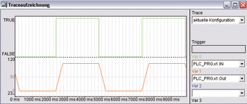

<!--
  Copyright (c) 2026 Hans Mühlbauer, Franz Höpfinger and others.

  This program and the accompanying materials are made available under the
  terms of the Eclipse Public License 2.0 which is available at
  https://www.eclipse.org/legal/epl-2.0

  SPDX-License-Identifier: EPL-2.0
-->

## RMP_SOFT

| | |
|:---|:---|
| **Type** | Funktionsbaustein |
| **Input	IN** | BOOL (Freigabeeingang) |
| **VAL** | Byte (Maximaler Ausgangswert) |
| **Output	OUT** | Byte (Ausgangssignal) |
| | RMP_SOFT glättet die Rampen eines Eingangssignals VAL. Das Signal Out folgt dem Eingangssignal VAL, wobei sowohl Anstiegszeit wie auch Abfallzeit durch PT_ON und PT_OFF begrenzt werden können. Die Anstiegszeit und Abfallzeit der Rampen sind durch Setup-Parameter im Modul RMP_SOFT definiert. Die Setup-Zeit PT_ON Gibt an, wie lange die Rampe von 0..255 dauert. Eine Rampe die durch VAL begrenzt ist, ist entsprechend kürzer. PT_OFF definiert entsprechend die fallende Rampe. Wird der Eingang IN auf FALSE gesetzt entspricht dies einem VAL Wert von 0, somit kann durch schalten des Eingangs IN zwischen 0 und VAL umgeschaltet werden. |
| **Setup	PT_ON** | TIME (Anstiegszeit, Default ist 100 ms) |
| **PT_OFF** | TIME (Abfallzeit, Default ist 100 ms) |

**Beispiel:**

Beispiel:
