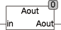

<!--
  Copyright (c) 2026 Hans Mühlbauer, Franz Höpfinger and others.

  This program and the accompanying materials are made available under the
  terms of the Eclipse Public License 2.0 which is available at
  https://www.eclipse.org/legal/epl-2.0

  SPDX-License-Identifier: EPL-2.0
-->

## Type	Funktion

| | |
|:---|:---|
| **Input	IN** | REAL (Eingangswert) |
| **Output** | DWORD (Ausgangswort zum A/D Wandler) |
| **Setup	BITS** | Byte (Anzahl der Bits, 16 für ein komplettes Wort) |
| **SIGN** | Byte (Sign Bit, 15 für Bit 15) |
| **LOW** | REAL (kleinster Wert des Eingangs) |
| **HIGH** | REAL (größter Wert des Eingangs) |
| | Eingänge von D/A Wandlern benötigen in der Regel ein WORD (16 Bit) oder DWORD (32 Bit), wobei Sie selbst meist nicht 16 Bit oder 32 Bit Auflösung haben. Weiterhin erzeugen D/A Wandler einen festen Ausgangsbereich (z B. -10 .. + 10 V) was zum Beispiel mit den digitalen Werten 0 .. 65535 (Bei 16 Bit) repräsentiert wird. Die Funktion AOUT wird durch Setup-Parameter konfiguriert und rechnet die Eingangswerte (IN) entsprechend um, sodass nach dem Modul AOUT ein digitaler Wert zur Verfügung steht, der am Ausgang des D/A Wandlers einen Wert erzeugt, der mit dem REAL-Wert IN übereinstimmt. Weiterhin kann das Modul ein Sign-Bit an beliebiger Stelle einfügen falls der D/A Wandler ein Sign-Bit benötigt. Durch einen Doppelklick auf den Baustein können mehrere Setup-Variablen gesetzt werden. Bits definiert wie viele Bits der D/A Wandler verarbeiten kann. Für einen 12 Bit Wandler ist dieser Wert 12. Es werden dann nur die Bits 0 – 11 belegt. Sign definiert, ob ein Vorzeichenbit benötigt wird und wo im Ausgangs-DWORD es zu platzieren ist. Sign=255 bedeutet, dass kein Vorzeichenbit benötigt wird, und 15 bedeutet das Bit 15 im DWORD das Vorzeichen enthält. LOW und HIGH definieren den kleinsten und höchsten Eingangswert. Ist ein Sign-Bit definiert, so müssen LOW und HIGH positiv sein. Ohne Sign-Bit können Sie sowohl positiv als auch negativ sein. |

**Beispiel:**

Beispiele: Ein 12 Bit D/A Wandler ohne Vorzeichen und Ausgangsbereich 0 – 10 wird wie folgt definiert: Bits=12, Sign=255, LOW=0, HIGH=10. Ein 14 Bit D/A Wandler mit Vorzeichen in Bit 14 und Ausgangsbereich -10 - +10 wird folgendermaßen definiert: Bits=14, Sign=14, LOW=0, HIGH=+10. Ein 24 Bit D/A Wandler ohne Vorzeichen und Ausgangsbereich -10 - +10 wird folgendermaßen definiert: Bits=24, Sign=255, LOW=-10, HIGH=+10.
