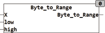

<!--
  Copyright (c) 2026 Hans Mühlbauer, Franz Höpfinger and others.

  This program and the accompanying materials are made available under the
  terms of the Eclipse Public License 2.0 which is available at
  https://www.eclipse.org/legal/epl-2.0

  SPDX-License-Identifier: EPL-2.0
-->

## Type	Funktion

| | |
|:---|:---|
| **Input	IN** | BYTE (Eingangswert) |
| **LOW** | REAL (Ausgangswert bei X = 0) |
| **HIGH** | REAL (Ausgangswert bei X = 255) |
| **Output** | REAL (Ausgangswert) |
| | BYTE_TO_RANGE wandelt einen BYTE Wert in einen REAL. Ein Eingangswert von 0 entspricht dabei dem REAL Wert von LOW und eine Eingangswert von 255 entspricht dem Eingangswert von HIGH. |
| **Um einen BYTE Wert von 0..255 in einen Prozentwert von 0..100 zu Wandeln wird der Baustein wie folgt aufgerufen** |  |
| | BYTE_TO_RANGE(X,0,100) |

