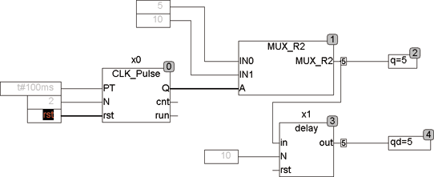

<!--
  Copyright (c) 2026 Hans Mühlbauer, Franz Höpfinger and others.

  This program and the accompanying materials are made available under the
  terms of the Eclipse Public License 2.0 which is available at
  https://www.eclipse.org/legal/epl-2.0

  SPDX-License-Identifier: EPL-2.0
-->

## Type	Funktionsbaustein

| | |
|:---|:---|
| **Input	IN** | REAL (Eingangswert) |
| **N** | INT (Anzahl der Verzögerungs Zyklen) |
| **RST** | BOOL (asynchroner Reset) |
| **Output	OUT** | REAL (verzögerter Ausgangswert) |
| | DELAY verzögert ein Eingangssignal (in) um N Zyklen. Der Eingang Reset ist asynchron und kann jederzeit den Delay Puffer löschen. |
| | Das Beispiel zeigt einen Generator, der Impulse von 5 nach 10 erzeugt und ein Delay, das 10 Zyklen Verzögerung erzeugt. |

