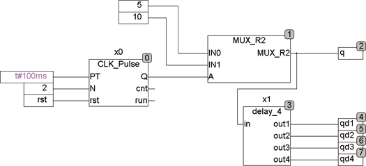
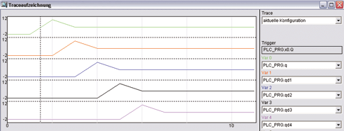

<!--
  Copyright (c) 2026 Hans Mühlbauer, Franz Höpfinger and others.

  This program and the accompanying materials are made available under the
  terms of the Eclipse Public License 2.0 which is available at
  https://www.eclipse.org/legal/epl-2.0

  SPDX-License-Identifier: EPL-2.0
-->

## Type	Funktionsbaustein

| | |
|:---|:---|
| **Input	IN** | REAL (Eingangswert) |
| **Output	OUT1** | REAL (um 1 Zyklus verzögerter Ausgangswert) |
| **OUT2** | REAL (um 2 Zyklen verzögerter Ausgangswert) |
| **OUT3** | REAL (um 3 Zyklen verzögerter Ausgangswert) |
| **OUT4** | REAL (um 4 Zyklen verzögerter Ausgangswert) |
| | DELAY_4 verzögert eine Eingangssignal um maximal 4 Zyklen. An den Ausgängen Out1..4 stehen die letzten 4 Werte zur Verfügung. Out1 ist um einen Zyklus verzögert, Qut2 um 2 Zyklen, Out3 um 3 Zyklen und Out4 um 4 Zyklen. |

**Beispiel:**

Beispiel:
