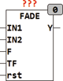

<!--
  Copyright (c) 2026 Hans Mühlbauer, Franz Höpfinger and others.

  This program and the accompanying materials are made available under the
  terms of the Eclipse Public License 2.0 which is available at
  https://www.eclipse.org/legal/epl-2.0

  SPDX-License-Identifier: EPL-2.0
-->

## Type	Funktionsbaustein

| | |
|:---|:---|
| **Input	IN1** | REAL (Eingangswert 1) |
| **IN2** | REAL (Eingangswert 2) |
| **F** | BOOL (Auswahl Eingang TRUE = IN2) |
| **TF** | TIME (Überblendzeit) |
| **RST** | BOOL (Asynchroner Reset) |
| **Output	Y** | REAL (Ausgangswert) |
| | FADE wird benutzt um zwischen 2 Eingängen IN1 und IN2 mit einem weichen Übergang umzuschalten. Die Umschaltzeit wird dabei mit TF angegeben. Ein asynchroner Reset (RST) setzt den Baustein ohne Verzögerung auf IN1 wenn F = FALSE oder auf IN2 wenn F = TRUE. Ein Umschaltvorgang wird durch eine Wertänderung an F ausgelöst. Anschließend wird innerhalb der Zeit TF zwischen den beiden Eingängen Umgeschaltet. Die Umschaltung erfolgt indem während der Umschaltzeit die beiden Eingänge gemischt werden. Am Anfang der Umschaltzeit stehen am Ausgang 0% des neuen Wertes und 100% des alten Wertes an. nach der halben Umschaltzeit (TF/2) ist der Ausgang jeweils 50% der beiden Eingangswerte ( Y = in1*0.5 + in2*0.5). nach Ablauf der Zeit TF liegt dann am Ausgang der neue Wert zu 100% an. |
| **Während der Umschaltzeit beträgt der Ausgang Y** |  |
| | Y = TU/TF * IN1 + (1 - TU/TF) * IN2. |
| | TU ist dabei die seit Beginn der Umschaltung vergangene Zeit. |
| | Da der Ausgang von FADE dynamisch berechnet wird kann der Baustein auch zur Umschaltung von dynamischen Signalen verwendet werden. Die Umschaltung wird in bis zu 65535 Stufen eingeteilt, die jedoch durch die Zykluszeit der SPS begrenzt werden können. Eine SPS mit einer Zykluszeit von 10ms und einer TF von einer Sekunde wird lediglich in 1s/10ms = 100 Stufen Umschalten. |

