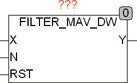

<!--
  Copyright (c) 2026 Hans Mühlbauer, Franz Höpfinger and others.

  This program and the accompanying materials are made available under the
  terms of the Eclipse Public License 2.0 which is available at
  https://www.eclipse.org/legal/epl-2.0

  SPDX-License-Identifier: EPL-2.0
-->

## Type	Funktion : DWORD

| | |
|:---|:---|
| **Input	X** | DWORD (Eingangswert) |
| **N** | UINT (Anzahl der ermittelten Werte) |
| **RST** | BOOL (asynchroner Reset Eingang) |
| **Output	Y** | DWORD (gefilterter Wert) |
| | FILTER_MAV_DW ist ein Filter mit gleitendem Mittelwert. Beim Filter mit gleitendem Mittelwert (auch MovingAverage Filter genannt) wird der Mittelwert von N aufeinander folgenden Messwerten als Mittelwert ausgegeben. |
| **Y** | = (X0 + X1 + … + Xn-1) / N |
| | X0 ist der Wert X im momentanen Zyklus, X1 ist der Wert im Zyklus davor usw. Die Anzahl der Werte über die der Mittelwert gebildet werden soll wird am Eingang N spezifiziert, der Wertebereich von N liegt zwischen 1 und 32. |

