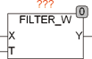

<!--
  Copyright (c) 2026 Hans Mühlbauer, Franz Höpfinger and others.

  This program and the accompanying materials are made available under the
  terms of the Eclipse Public License 2.0 which is available at
  https://www.eclipse.org/legal/epl-2.0

  SPDX-License-Identifier: EPL-2.0
-->

## Type	Funktion : WORD

| | |
|:---|:---|
| **Input	X** | WORD (Eingangswert) |
| **T** | TIME (Zeitkonstante des Filters) |
| **Output	Y** | WORD (gefilterter Wert) |
| | FILTER_W ist ein Filter ersten Grades für 16 Bit WORD Daten. Die Hauptanwendung ist das Filtern von Sensorsignalen zur Rauschunterdrückung. Die grundlegende Funktionalität eines Filters ersten Grades kann beim Baustein FT_PT1 nachgelesen werden. |

