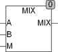

<!--
  Copyright (c) 2026 Hans Mühlbauer, Franz Höpfinger and others.

  This program and the accompanying materials are made available under the
  terms of the Eclipse Public License 2.0 which is available at
  https://www.eclipse.org/legal/epl-2.0

  SPDX-License-Identifier: EPL-2.0
-->

## Type	Funktion : REAL

| | |
|:---|:---|
| **Input	A** | REAL (Eingangswert 1) |
| **B** | REAL (Eingangswert 2) |
| **M** | REAL (Mischungsverhältnis) |
| **Output** | REAL (Wert aus dem Mischungsverhältnis M zwischen A und B) |
| | MIX stellt am Ausgang einen mit dem Mischungsverhältnis M gemischten Wert aus A und B zur Verfügung. Der Eingang M gibt den Anteil vom B in Bereich 0..1 an. |
| | MIX = (M-1)*A + M*B |

