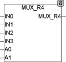

<!--
  Copyright (c) 2026 Hans Mühlbauer, Franz Höpfinger and others.

  This program and the accompanying materials are made available under the
  terms of the Eclipse Public License 2.0 which is available at
  https://www.eclipse.org/legal/epl-2.0

  SPDX-License-Identifier: EPL-2.0
-->

## MUX_R4

| | |
|:---|:---|
| **Type** | Funktion |
| **Input	IN0** | REAL (Eingangswert 0) |
| **IN1** | REAL (Eingangswert 1) |
| **IN2** | REAL (Eingangswert 0) |
| **IN3** | REAL (Eingangswert 1) |
| **A0** | BOOL (Adresseingang Bit 0) |
| **A1** | BOOL (Adresseingang Bit 1) |
| **Output** | REAL (IN0 wenn A0=0 und A1=0, IN3 wenn A0=1 und A3=1) |
| | MUX_R4 wählt einen von 4 Eingangswerten aus. |
| **Logische Verknüpfung** | IN0 wenn A0=0 & A1=0, |
| | IN1 wenn A0=1 & A1=0; |
| | IN2 wenn A0=0 & A1=1; |
| | IN3 wenn A0=1 & A1=1; |

