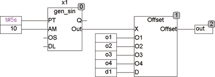

<!--
  Copyright (c) 2026 Hans Mühlbauer, Franz Höpfinger and others.

  This program and the accompanying materials are made available under the
  terms of the Eclipse Public License 2.0 which is available at
  https://www.eclipse.org/legal/epl-2.0

  SPDX-License-Identifier: EPL-2.0
-->

## OFFSET

| | |
|:---|:---|
| **Type** | Funktion |
| **Input	X** | REAL (Eingangssignal) |
| **O1** | BOOL (Enable Offset 1) |
| **O2** | BOOL (Enable Offset 2) |
| **O3** | BOOL (Enable Offset 3) |
| **D** | BOOL (EnableDefault) |
| **Output** | REAL (Ausgangswert mit Offset) |
| **Setup	Offset_1** | REAL (Offset der addiert wird, wenn O1=TRUE) |
| **Offset_2** | REAL (Offset der addiert wird, wenn O2=TRUE) |
| **Offset_3** | REAL (Offset der addiert wird, wenn O3=TRUE) |
| **Offset_4** | REAL (Offset der addiert wird, wenn O4=TRUE) |
| **Default** | REAL (Wird anstelle von X verwendet, wenn D=TRUE) |
| | Die Funktion Offset addiert verschiedene Offsets zu einem Eingangssignal abhängig vom Binären Wert an O1 .. O4.  Die Offsets können einzeln oder  gleichzeitig addiert werden. Mit dem Eingang D kann ein Default-Wert anstelle des Eingangs X auf den Addierer geschaltet werden. Die Offsets und der Default-Wert werden über Setup-Variablen definiert. |
| **Das folgende Beispiel verdeutlicht die Funktionsweise von Offset** |  |

