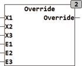

<!--
  Copyright (c) 2026 Hans Mühlbauer, Franz Höpfinger and others.

  This program and the accompanying materials are made available under the
  terms of the Eclipse Public License 2.0 which is available at
  https://www.eclipse.org/legal/epl-2.0

  SPDX-License-Identifier: EPL-2.0
-->

## OVERRIDE

| | |
|:---|:---|
| **Type** | Funktion |
| **Input	X1** | REAL (Eingangssignal 1) |
| **X2** | REAL (Eingangssignal 2) |
| **X3** | REAL (Eingangssignal 3) |
| **E1** | BOOL (Enable Signal 1) |
| **E2** | BOOL (Enable Signal 2) |
| **E2** | BOOL (Enable Signal 3) |
| **Output** | REAL (Ausgangswert |
| | OVERRIDE liefert am Ausgang Y den Eingangswert (X1, X2, X3) dessen Absoluter Wert der größere von allen ist. Die Eingänge X1, X2 und X3 können jeder individuell mit den Eingängen E1, E2 und E3 freigeschaltet werden. wenn eines der Eingangssignale E1, E2 oder E3 auf FALSE steht wird der zugehörige Eingang X1, X2 oder X3 nicht berücksichtigt. Eine von vielen Anwendungsmöglichkeiten von OVERRIDE ist zum Beispiel die Abfrage von 3 Sensoren wobei der mit dem Höchsten Wert die anderen überschreibt. Mit den Eingängen E kann im Diagnosefall jeder Sensor einzeln abgefragt werden, oder ein defekter Sensor abgeschaltet werden. |



**Beispiel:**

```iecst
OVERRIDE(10,-12,11, TRUE, TRUE, TRUE) = -12 OVERRIDE(10,-12,11, TRUE, FALSE, TRUE) = 11 OVERRIDE(10,-12,11, FALSE, FALSE, FALSE) = 0
```
