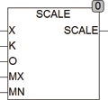

<!--
  Copyright (c) 2026 Hans Mühlbauer, Franz Höpfinger and others.

  This program and the accompanying materials are made available under the
  terms of the Eclipse Public License 2.0 which is available at
  https://www.eclipse.org/legal/epl-2.0

  SPDX-License-Identifier: EPL-2.0
-->

## SCALE

| | |
|:---|:---|
| **Type	Funktion** | REAL |
| **Input	X** | Byte (Eingangswert) |
| **K** | Byte (Multiplikator) |
| **O** | REAL (Offset) |
| **MX** | REAL (maximaler Ausgangswert) |
| **MN** | REAL (minimaler Ausgangswert) |
| **Output** | REAL (Ausgangswert) |
| | SCALE Multipliziert den Eingang X mit K und addiert den Offset O. Der so errechnete  Wert wird dann auf die Werte MN und MX begrenzt und das Ergebnis am Ausgang zur Verfügung gestellt. |
| | SCALE = LIMIT(MN, X * K + O, MX) |

