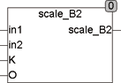
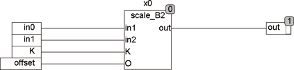

<!--
  Copyright (c) 2026 Hans Mühlbauer, Franz Höpfinger and others.

  This program and the accompanying materials are made available under the
  terms of the Eclipse Public License 2.0 which is available at
  https://www.eclipse.org/legal/epl-2.0

  SPDX-License-Identifier: EPL-2.0
-->

## SCALE_B2

| | |
|:---|:---|
| **Type	Funktion** | REAL |
| **Input	IN1** | Byte (Eingangswert 1) |
| **IN2** | Byte (Eingangswert 2) |
| **K** | REAL (Multiplikator) |
| **O** | REAL (Offset) |
| **Output** | REAL (Ausgangswert) |
| **Setup	IN1_MIN** | REAL (kleinster Wert für IN1) |
| **IN1_MAX** | REAL (größter Wert für IN1) |
| **IN2_MIN** | REAL (kleinster Wert für IN2) |
| **IN2_MAX** | REAL (größter Wert für IN2) |
| | SCALE_B2 berechnet aus dem Eingangswert IN und den Setup-Werten IN_MIN und IN_MAX einen internen Wert, addiert alle internen Werte, multipliziert die Summe mit K und addiert den Offset O. Ein Eingangswert IN1=0 bedeutet IN1_MIN wird berücksichtigt, IN1=255 bedeutet IN1_MAX wird berücksichtigt. Wird K nicht beschaltet so ist der Multiplikator 1. |
| **Out =** | (in1 * (IN1_MAX – IN1_MIN) / 255 + IN1_MIN 	+ in2 * |
| **(IN2_MAX –** | IN2_MIN) / 255 + IN2_MIN) * K + O |
| | SCALE_B2 kann zum Beispiel verwendet werden um Gesamtluftmengen in Lüftungsanlagen zu berechnen. Auch überall dort wo gesteuerte Mischer eingesetzt werden und die resultierende Gesamtmenge berechnet werden muss. |

**Beispiel:**

Beispiel: IN0 ist eine Luftklappe, die die Luftmenge zwischen 100m³/h und 600m³/h für die Stellwerte in0 (0 – 255) regelt. IN1 ist eine Abluftgerät, das die Abluftmenge von 0 m³/h bis 400 m³/h für die Stellwerte in1 von 0 – 255 regelt. Die Setup-Werte für diese Anwendung sind: IN0_MIN = 100, IN0_MAX = 600, IN1_MIN = 0, IN1_MAX = -400. Die resultierende Gesamtluftmenge bei K=1 und O=0 (kein Multiplikator und kein Offset) variiert dann von -300 (in0=0 und in1=255) bis +600 (in=255 und in1=0). Für einen Eingangswert in0=128 (Klappe 50%) und IN1=128 (Lüfter auf 50%) ist der Ausgangswert 250 m³ – 200 m³ = 50 m³. Der Eingang Offset kann auch dazu benutzt werden um Bausteine zu kaskadieren.
