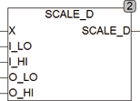

<!--
  Copyright (c) 2026 Hans Mühlbauer, Franz Höpfinger and others.

  This program and the accompanying materials are made available under the
  terms of the Eclipse Public License 2.0 which is available at
  https://www.eclipse.org/legal/epl-2.0

  SPDX-License-Identifier: EPL-2.0
-->

## SCALE_D

| | |
|:---|:---|
| **Type	Funktion** | REAL |
| **Input	X** | DWORD (Eingangswert) |
| **I_LO** | DWORD (Eingangswert min) |
| **I_HI** | DWORD (Eingangswert max) |
| **O_LO** | REAL (Ausgangswert min) |
| **O_HI** | REAL (Ausgangswert max) |
| **Output** | REAL (Ausgangswert) |
| | SCALE_D skaliert einen Eingangswert DWORD und errechnet einen Ausgangswert in REAL. Der Eingangswert X wird dabei auf I_LO und I_HI begrenzt. SCALE_D(IN, 0, 8191, 0, 100) skaliert einen Eingang mit 14 Bit Auflösung auf den Ausgang 0..100. SCALE_D kann auch mit negativen Ausgangswerten und negativer Steigung arbeiten, die Werte I_LO und I_HI müssen aber immer so spezifiziert werden, dass ILO < I_HI ist. |

