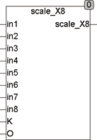

<!--
  Copyright (c) 2026 Hans Mühlbauer, Franz Höpfinger and others.

  This program and the accompanying materials are made available under the
  terms of the Eclipse Public License 2.0 which is available at
  https://www.eclipse.org/legal/epl-2.0

  SPDX-License-Identifier: EPL-2.0
-->

## Type	Funktion : REAL

| | |
|:---|:---|
| **Input	IN1 .. 8** | BOOL (Eingangswerte) |
| **K** | REAL (Multiplikator) |
| **O** | REAL (Offset) |
| **Output** | REAL (Ausgangswert) |
| **Setup	IN_MIN** | REAL (kleinster Wert für IN) |
| **IN_MAX** | REAL (größter Wert für IN) |
| | SCALE_X8 berechnet aus den Eingangswerten IN und den Setup-Werten IN_MIN und IN_MAX interne Werte, addiert alle internen Werte, multipliziert die Summe mit K und addiert den Offset O. Ein Eingangswert IN=FALSE bedeutet IN_MIN wird berücksichtigt, in=TRUE bedeutet IN_MAX wird berücksichtigt. Die Summe wird Mit K Multipliziert und Offset O addiert. Wird K nicht beschaltet so ist der Multiplikator 1. |
| | SCALE_X8 kann zum Beispiel verwendet werden um Gesamtluftmengen in Lüftungsanlagen zu berechnen, oder überall dort wo gesteuerte Klappen eingesetzt werden und die resultierende Gesamtmenge berechnet werden muss. Durch den Eingang Offset kann SCALE_X2 einfach mit den anderen SCALE Bausteinen kaskadiert werden. Weitere Erläuterungen und Beispiele finden Sie unter SCAE_X2. |

