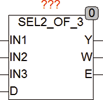

<!--
  Copyright (c) 2026 Hans Mühlbauer, Franz Höpfinger and others.

  This program and the accompanying materials are made available under the
  terms of the Eclipse Public License 2.0 which is available at
  https://www.eclipse.org/legal/epl-2.0

  SPDX-License-Identifier: EPL-2.0
-->

## Type	Funktion : REAL

| | |
|:---|:---|
| **Input	IN1** | REAL (Eingangswert 1) |
| **IN2** | REAL (Eingangswert 2) |
| **IN3** | REAL (Eingangswert 3) |
| **D** | REAL (Toleranzgrenze) |
| **Output	Y** | REAL (Ausgangswert) |
| **W** | INT (Warnung) |
| **E** | BOOL (Error Ausgang) |
| | SEL2_OF_3 wertet 3 Eingänge (IN1 .. IN3) aus und prüft ob die Abweichung der Eingangswert kleiner oder gleich D ist. Der Mittelwert aus den 3 Eingängen wird am Ausgang Y ausgegeben. Die einzelnen Eingänge werden nur dann berücksichtigt wenn Sie nicht weiter als D von einem anderen Eingang entfernt liegen. Wird der Mittelwert nur von 2 Eingängen gebildet, so wird die Nummer des nicht berücksichtigten Eingangs am Ausgang W ausgegeben. Ist W = 0 werden alle 3 Eingänge berücksichtigt. Falls alle 3 Eingänge mehr als D voneinander abweichen wird der Ausgang W = 4 gesetzt und der Ausgang E = TRUE gesetzt. Der Ausgang Y wird in diesem Falle nicht verändert und bleibt auf dem letzten gültigen Wert stehen. |
| | Eine typische Anwendung für den Baustein ist die Erfassung von 3 Sensoren die dieselbe Prozessgröße Messen um zum Beispiel Messfehler durch unterschiedliche Erfassung oder Drahtbruch zu verringern. |

