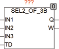

<!--
  Copyright (c) 2026 Hans Mühlbauer, Franz Höpfinger and others.

  This program and the accompanying materials are made available under the
  terms of the Eclipse Public License 2.0 which is available at
  https://www.eclipse.org/legal/epl-2.0

  SPDX-License-Identifier: EPL-2.0
-->

## Type	Funktion : BOOL

| | |
|:---|:---|
| **Input	IN1** | BOOL (Eingang 1) |
| **IN2** | BOOL (Eingang 2) |
| **IN3** | BOOL (Eingang 3) |
| **TD** | TIME (Delay für Ausgang W) |
| **Output	Q** | BOOL (Ausgang) |
| **W** | BOOL (Warnmeldung) |
| | SEL2_OF_3B wertet 3 redundante Binäre Eingänge aus und liefert am Ausgang Q den Wert den mindestens 2 der 3 Eingänge anliegen haben. Falls einer der 3 Eingänge einen anderen Wert als die beiden anderen hat wird der Ausgang W als Warnung gesetzt. Damit bei nicht exakt Zeitgleichen Umschalten der Eingänge der Ausgang W nicht anspricht kann für diesen eine Ansprechverzögerung TD festgelegt werden. |

