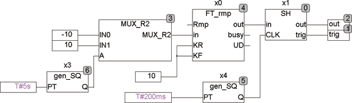

<!--
  Copyright (c) 2026 Hans Mühlbauer, Franz Höpfinger and others.

  This program and the accompanying materials are made available under the
  terms of the Eclipse Public License 2.0 which is available at
  https://www.eclipse.org/legal/epl-2.0

  SPDX-License-Identifier: EPL-2.0
-->

## Type	Funktionsbaustein

| | |
|:---|:---|
| **Input	IN** | REAL (Eingangssignal) |
| **CLK** | BOOL (Takteingang) |
| **Output	OUT** | REAL (Ausgangssignal) |
| **TRIG** | BOOL (Trigger Output) |
| | SH ist ein Sampleand Hold Baustein. Er speichert bei jeder steigenden Flanke von CLK das Eingangssignal IN am Ausgang OUT. Nach jedem update von OUT bleibt TRIG für einen Zyklus TRUE. |
| **Das Folgende Beispiel erläutert die Funktionsweise von SH** |  |

