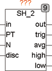
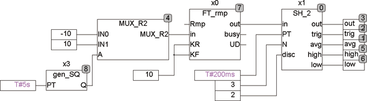

<!--
  Copyright (c) 2026 Hans Mühlbauer, Franz Höpfinger and others.

  This program and the accompanying materials are made available under the
  terms of the Eclipse Public License 2.0 which is available at
  https://www.eclipse.org/legal/epl-2.0

  SPDX-License-Identifier: EPL-2.0
-->

## Type	Funktionsbaustein

| | |
|:---|:---|
| **Input	IN** | REAL (Eingangssignal) |
| **PT** | TIME (Abtastzeit) |
| **N** | INT (Anzahl der Samples für Statistik) |
| **DISC** | INT (Verwerfe DISC Werte) |
| **Output	OUT** | REAL (Ausgangssignal) |
| **TRIG** | BOOL (Trigger Output) |
| **AVG** | REAL (Durchschnittswert) |
| **HIGH** | REAL (Maximalwert) |
| **LOW** | REAL (Minimalwert) |
| | SH_2 ist ein Sampleand Hold Baustein mit einstellbarer Abtastzeit. Er speichert alle PT das Eingangssignal IN am Ausgang OUT. Nach jedem update von OUT bleibt TRIG für einen Zyklus TRUE. Zusätzlich zur Funktion eines Sampleand Hold Bausteins bietet SH_2 bereits integrierte Funktionalität bezüglich der Statistik. Mit dem Eingang N kann spezifiziert werden, über wie viele Samples (maximal 16) ein Mittelwert, Minimalwert und Maximalwert gebildet werden. Als weitere Eigenschaft können aus den N Samples für die Statistik auch kleinste und größte Werte ignoriert werden, was sehr sinnvoll sein kann um Extremwerte zu ignorieren. Der Eingangswert DISC=0 bedeutet alle Samples benutzen, eine 1 bedeutet den niedrigsten Wert ignorieren, 2 bedeutet den niedrigsten und den höchsten Wert ignorieren usw. Wenn zum Beispiel N=5 und DISC=2, dann werden 5 Samples gesammelt, der niedrigste und der höchste Wert werden verworfen und über die 3 verbleibenden Samples wird der Mittelwert, Minimalwert und Maximalwert gebildet. |
| **Das Folgende Beispiel erläutert die Funktionsweise von SH_2** |  |

