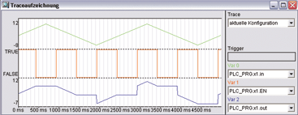

<!--
  Copyright (c) 2026 Hans Mühlbauer, Franz Höpfinger and others.

  This program and the accompanying materials are made available under the
  terms of the Eclipse Public License 2.0 which is available at
  https://www.eclipse.org/legal/epl-2.0

  SPDX-License-Identifier: EPL-2.0
-->

## Type	Funktionsbaustein

| | |
|:---|:---|
| **Input	IN** | REAL (Eingangssignal) |
| **E** | BOOL (enable Signal) |
| **Output	OUT** | REAL (Ausgangssignal) |
| | SH_T ist ein transparenter Sampleand Hold Baustein. Das Eingangssignal in ist solange am Ausgang verfügbar, wie E gleich TRUE ist. Mit einer fallenden Flanke von E wird der Wert von in am Ausgang OUT gespeichert und bleibt solange bestehen bis E wieder TRUE wird und dadurch wieder in auf OUT geschaltet wird. |
| **Das folgende Beispiel verdeutlicht die Arbeitsweise von SH_T** |  |

