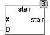
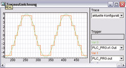

<!--
  Copyright (c) 2026 Hans Mühlbauer, Franz Höpfinger and others.

  This program and the accompanying materials are made available under the
  terms of the Eclipse Public License 2.0 which is available at
  https://www.eclipse.org/legal/epl-2.0

  SPDX-License-Identifier: EPL-2.0
-->

## Type	Funktion

| | |
|:---|:---|
| **Input	X** | REAL (Eingangssignal) |
| **D** | REAL (Schrittweite des Ausgangssignals) |
| **Output** | REAL (Ausgangssignal) |
| | Das Ausgangssignal von STAIR folgt dem Eingangssignal X mit einer Treppenfunktion. Die Höhe der Stufen ist vorgegeben durch D. Wird X = 0, so folgt das Ausgangssignal direkt dem Eingangssignal. STAIR ist jedoch nicht zum filtern von Eingangssignalen geeignet, denn wenn der Eingang um eine Treppenschwelle schwankt, schaltet der Ausgang zwischen zwei benachbarten Werten hin und her. Für diesen Zweck empfehlen wir den Einsatz von Stair2, der mit einer Hysterese arbeitet und instabile Zustände vermeidet. |
| **Das folgende Beispiel verdeutlicht die Arbeitsweise von STAIR** |  |

