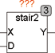

<!--
  Copyright (c) 2026 Hans Mühlbauer, Franz Höpfinger and others.

  This program and the accompanying materials are made available under the
  terms of the Eclipse Public License 2.0 which is available at
  https://www.eclipse.org/legal/epl-2.0

  SPDX-License-Identifier: EPL-2.0
-->

## STAIR2

| | |
|:---|:---|
| **Type** | Funktionsbaustein |
| **Input	X** | REAL (Eingangssignal) |
| **D** | REAL (Schrittweite des Ausgangssignals) |
| **Output	Y** | REAL (Ausgangssignal) |
| | Das Ausgangssignal von STAIR2 folgt dem Eingangssignal X mit einer Treppenfunktion. Die Höhe der Stufen ist vorgegeben durch D. Wird D = 0, so folgt das Ausgangssignal direkt dem Eingangssignal. Das Signal folgt der Treppe aber mit einer Hysterese von D so dass ein verrauschtes Eingangssignal keine Sprünge zwischen Treppenwerten auslösen kann. STAIR2 ist auch als Eingangsfilter geeignet. |
| **Das folgende Beispiel verdeutlicht die Arbeitsweise von STAIR2** |  |

