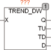

<!--
  Copyright (c) 2026 Hans Mühlbauer, Franz Höpfinger and others.

  This program and the accompanying materials are made available under the
  terms of the Eclipse Public License 2.0 which is available at
  https://www.eclipse.org/legal/epl-2.0

  SPDX-License-Identifier: EPL-2.0
-->

## Type	Funktionsbaustein

| | |
|:---|:---|
| **Input	X** | DWORD (Eingangssignal) |
| **Output	Q** | BOOL (X steigend = TRUE) |
| **TU** | BOOL (TRUE wenn sich Eingang X erhöht) |
| **TD** | BOOL (TRUE wenn sich Eingang X reduziert) |
| **D** | DWORD (Delta der Eingangsänderung) |
| | TREND_DW überwacht den Eingang X und zeit am Ausgang Q an ob X steigt (Q = TRUE) oder X fällt (Q = FALSE). wenn sich X nicht verändert bleibt Q auf seinen letzten Wert stehen. Erhöht sich X so wird der Ausgang TU für einen Zyklus TRUE und am Ausgang D wird X – LAST_X angezeigt. Ist X niedriger als LAST_X so wird TD für einen Zyklus TRUE und am Ausgang D wird LAST_X – X ausgegeben. LAST_X ist ein interner Wert des Bausteins und ist der Wert von X im letzten Zyklus. |

