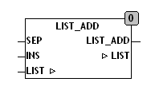

<!--
  Copyright (c) 2026 Hans Mühlbauer, Franz Höpfinger and others.

  This program and the accompanying materials are made available under the
  terms of the Eclipse Public License 2.0 which is available at
  https://www.eclipse.org/legal/epl-2.0

  SPDX-License-Identifier: EPL-2.0
-->

## LIST_ADD

| | |
|:---|:---|
| **Type	Funktion** | BOOL |
| **Input	SEP** | BYTE (Separationszeichen der Liste) |
| **INS** | STRING (Neues Element) |
| **I/O	LIST** | STRING(LIST_LENGTH) (Eingangsliste) |
| **Output** | BOOL (TRUE) |
| | LIST_ADD addiert ein weiteres Element an das Ende einer Liste. Die Liste besteht aus  Zeichenketten (Elementen) die mit dem Separationszeichen SEP beginnen. |



**Beispiel:**

```iecst
LIST_ADD('&ABC&23&&NEXT', 38, 'NEW') = '&ABC&23&&NEXT&NEW'
```
